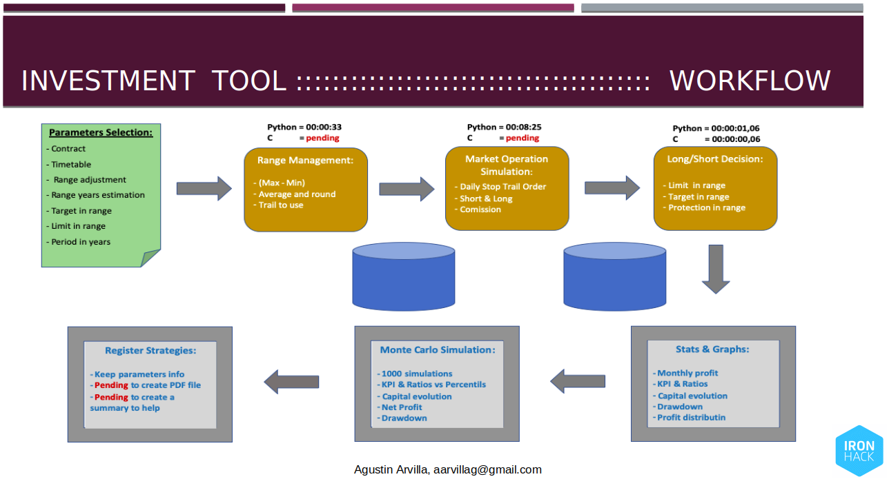
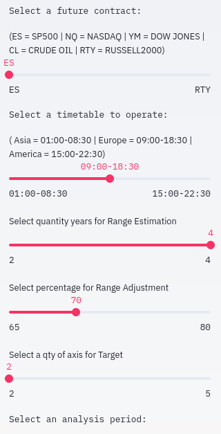
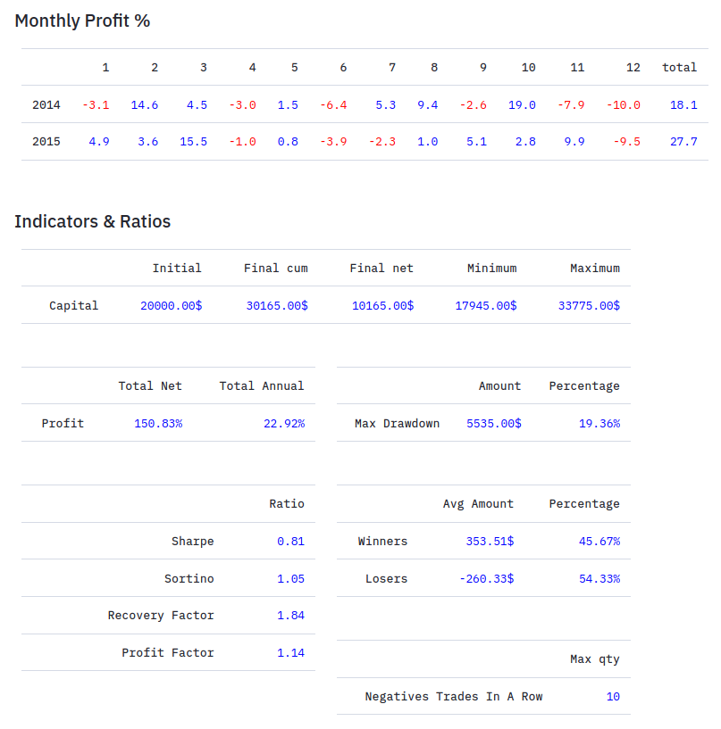
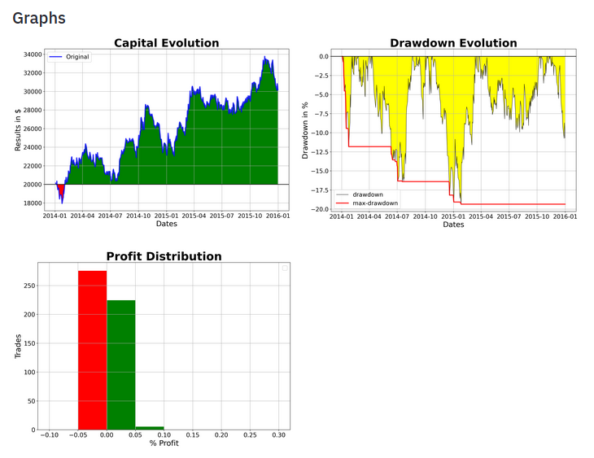
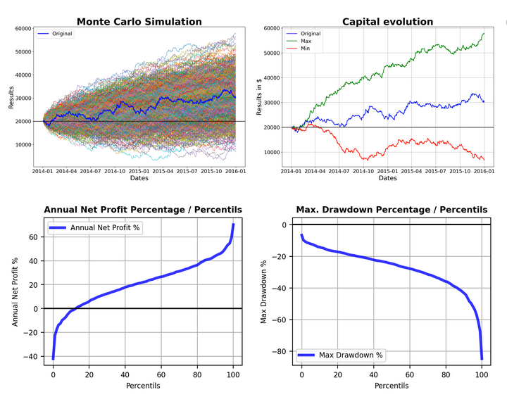

# ih_datamadpt0420_project_final

   

# 1. NAME: **Tool for Investment System about Futures in Financial Markets**

   

# 2. STATUS: Final Project for **Ironhack Data Analysis Bootcamp April 2020**

# 3. ONE-LINER: 
#### With this project data analysis, the reader can check an investment system that it consist on a backtest of an investment system based on intraday orders in American future markets.
#### The system has some parameters that are fixed forming an strategy. These parameters are the following
   - Timetable to operate in the market
   - The contract to use (SP500, Dow Jones, Nasdaq, Crude Oil, Russell2000)
   - The qty years to use for calculate an average daily range to use it as a base of a target and a limit.
   - Periods in years to analyse
    
#### Then with app built with streamlit you can modify parameters and get the result of the backtest in 20 seconds

# 4. TECHNOLOGY STACK: 

   - We use **python** as a base code lenguage.
   - Libraries we have used for data manipulation in this project are the following,
        - Panda
        - Matplotlib
        - Pyplot
        - Numpy
        - Datetime
        - Random
        - Sys


   - Coding lenguages we have used for this project are the following,
        - Python
        - C
        

   - Library to build an app for visualization
        - Streamlit
   
   
   - Pipeline 
        - Argeparse, Subprocess, Pycharm, Jupyter
        

# 5. TECHNICAL CONCEPTS AND WORKFLOW

   - It is clear that the first step is selecting parameters. We have a selection zone in the tool.
        - Future contract (SP500, Nasdaq, Dow Jones, Crude Oil, Russell2000)
        - Timetable (01:00-08:30, 09:00-18:30, 15:00-22:30)
        - Quantity of years to estimate range (2, 3, 4)
        - Percentage to adjust the range (65, 70, 75, 80)
        - Quantity ranges to target (2, 3, 4, 5)
        - Period in years (2014-2020)
   
   
   - The first step of the process is the management range to get an estimation of this range (with maximum - minimum), calculate an average of years selected and then adjust to get the final figure (trail). This step takes 33 seconds with a program in Python. We will improve this time with C.
   - The second step is to do a Market Simulation. We emulate the market operation everyday with a long operation and a short operation with STOP TRAIL order in the broker, during the timetable selected. We will operate everyday long or short, but at first we emulate both operation. This step takes 8 minutes and 25 seconds with a program in Python. We will improve this time with C. 
   - The third step of the process is for selecting the daily operation long or short. There are various systems to select but we have use only one. This step takes 1,06 seconds with a program in Python. We have already redo in C and now it takes 0,06 seconds.
   
   
   - Once the data is processed we can start with stats, ratios and visualization. Then we do a simulation process to check all possibilities with Monte Carlo.
   
   - The last part is how to register the different strategies and how to compare among them.

 

# 6. USAGE: 

#### You can use the tool with streamlit.
   - You should run with the same folder structure described below.
   - The data has been supplied by Kibot (US company) and it is a dataset per contract with market price data (every 15 minutes) from 2009 until today (October 2020).
   - The data has been preprocessed to avoid long waits to get the result of workflow. This data preprocessed it is located in data folder.

   - From terminal console you can type the following to run the tool from streamlit folder,
                   `streamlit run first_app.py`

              


# 7. FOLDER STRUCTURE AND FILES
```
└── ih_datamadpt0420_project_final
    ├── Data
    │   ├── ........ preprocessed data
    │   └── ........ preprocessed data
    ├── notebooks
    │   ├── P00DatetimeTransformation.ipynb
    │   ├── P01VariableDefinition.ipynb
    │   ├── P02RangetrialEstimation.ipynb
    │   ├── P03OperationInMarket.ipynb
    │   └── P04ShortLongDecision.ipynb    
    ├── p_analysis
    │   ├── __init__.py
    │   └── m_longshort.py
    ├── p_operating
    │   ├── __init__.py
    │   └── m_operation.py
    ├── p_ranging
    │   ├── __init__.py
    │   └── m_dataranging.py
    ├── p_readingdata
    │   ├── __init__.py
    │   └── m_acquisition.py
    ├── p_reporting
    │   ├── __init__.py
    │   ├── m_statis_plotis.py
    │   └── m_montecarlo.py
    ├── streamlit
    │   ├── all_function.py
    │   └── first_app.py
    ├── CL.csv
    ├── ES.csv
    ├── graphs.png
    ├── Input-config-complete.csv
    ├── Input-config.csv
    ├── LongShort
    ├── LongShort.c
    ├── main_scrip.py
    ├── NQ.csv
    ├── PresentationFinalProject=Ironhack.pptx 
    ├── Ratios.png
    ├── README.md
    ├── robot.jpeg
    ├── RTY.csv
    ├── selector.png
    ├── simulation.png
    ├── workflow.png
    ├── 
    └── YM.txt
```


# 8. CONTACT INFO 

####       aarvillag@gmail.com